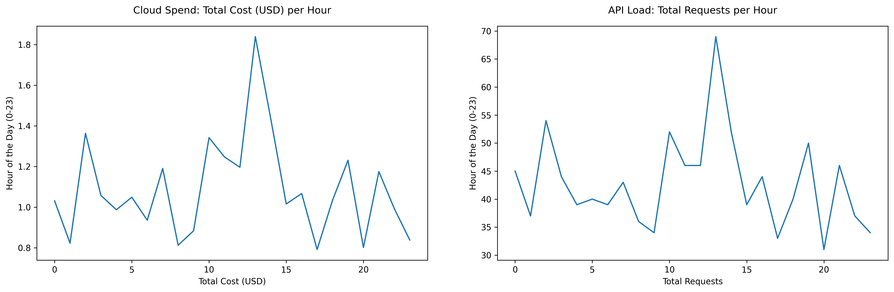
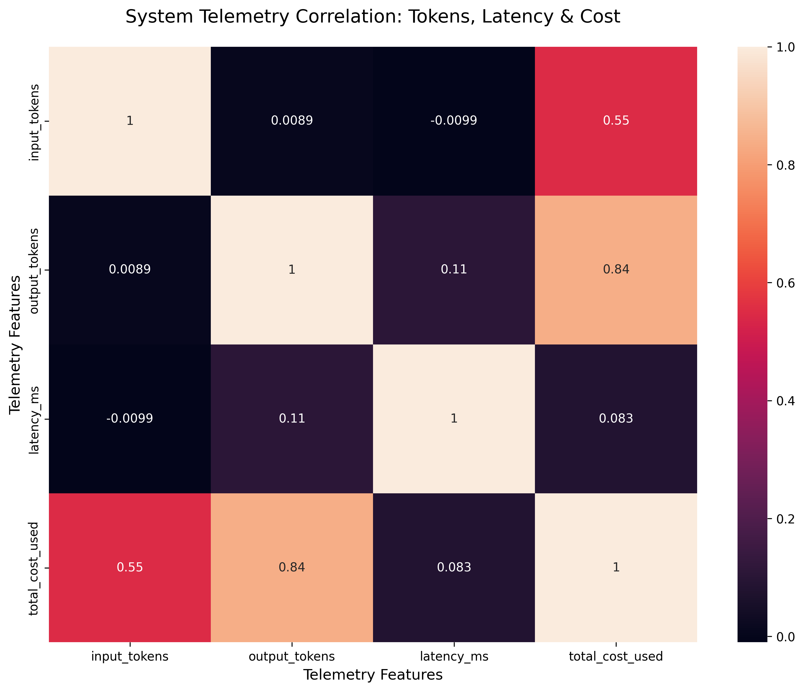
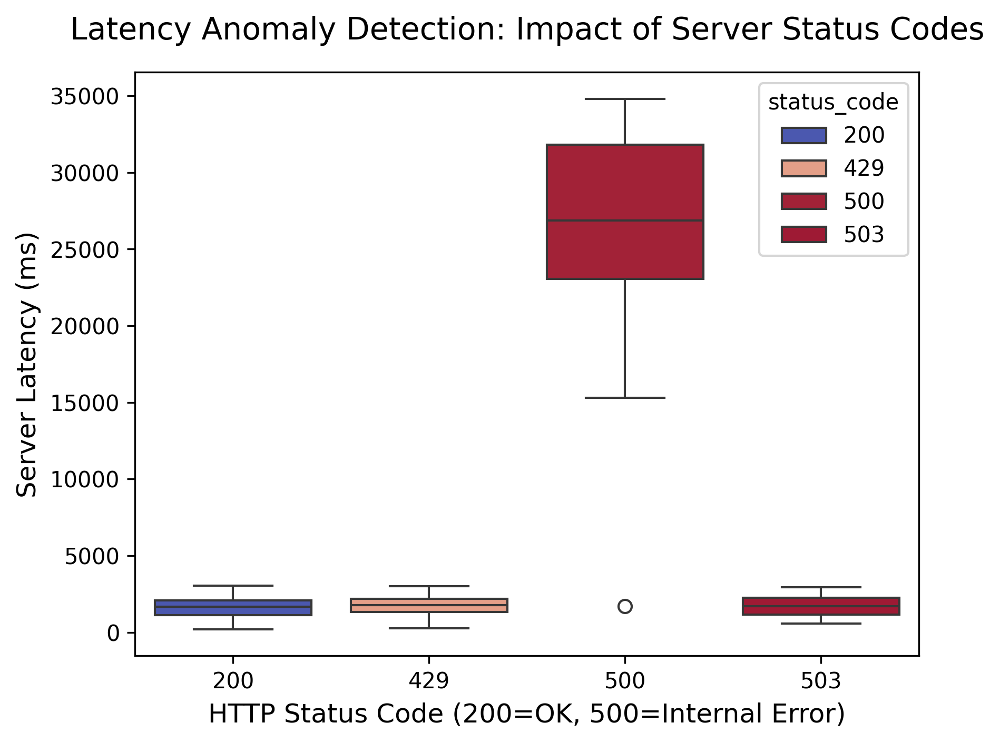
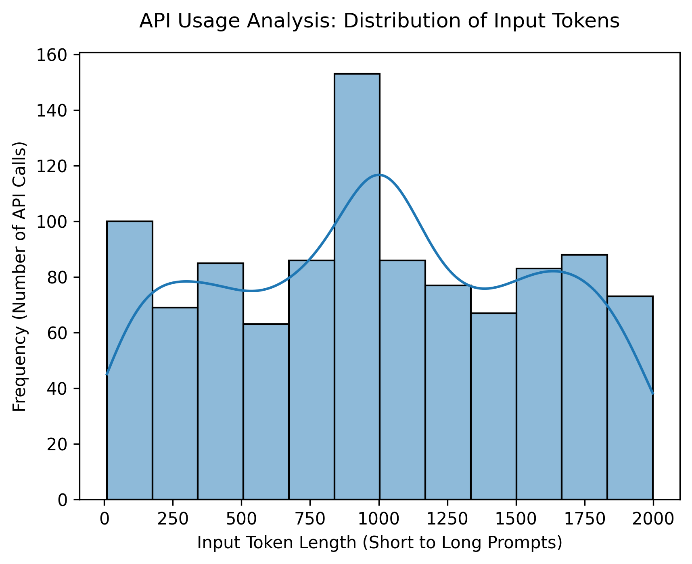
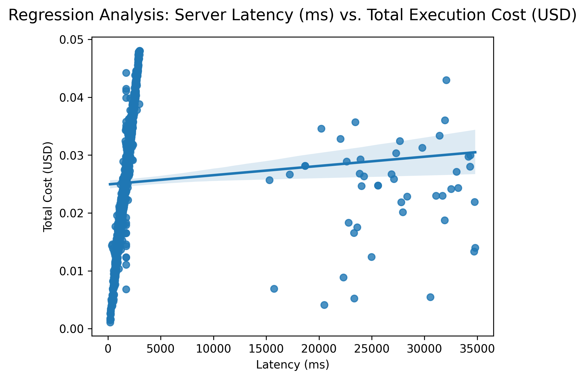
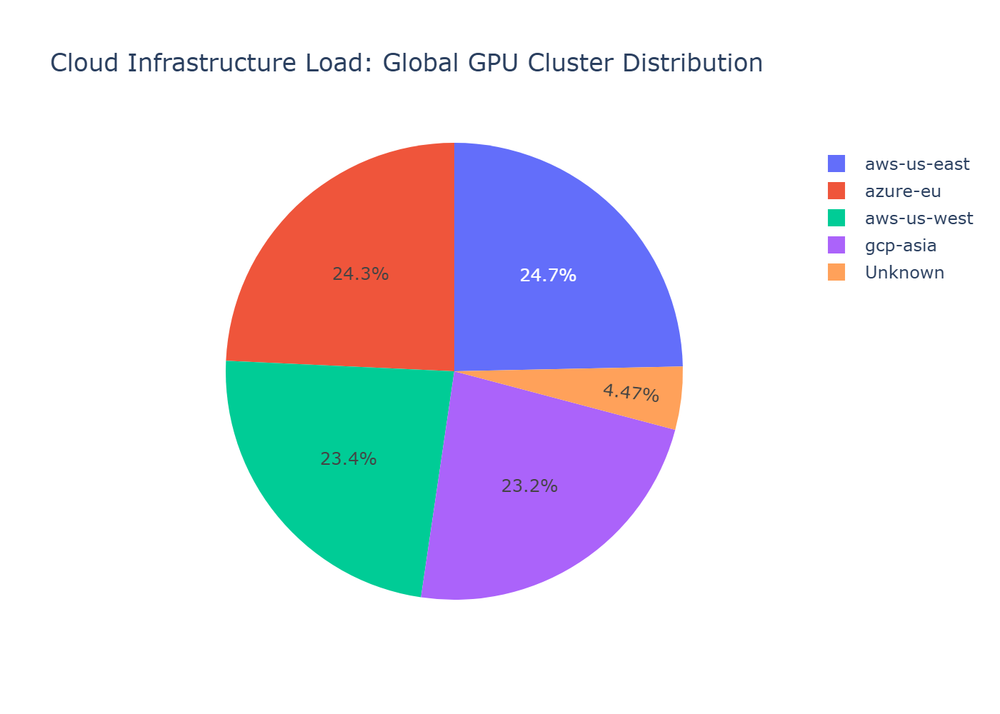
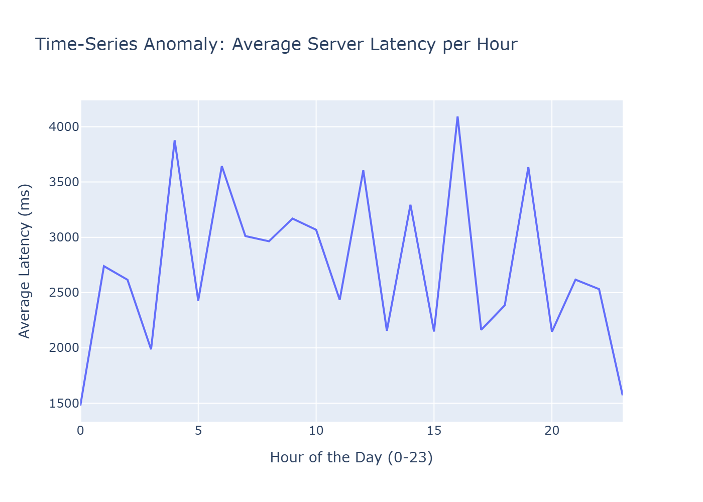
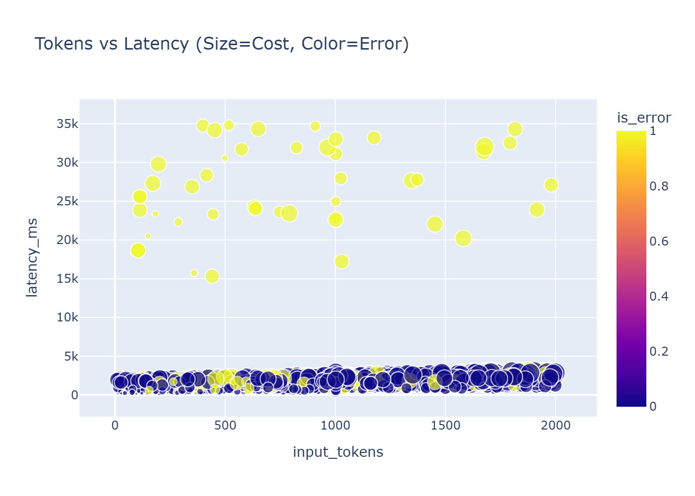

# 🚀 LLM Ops Telemetry & Performance Analytics


## 📌 Executive Overview
This repository contains an enterprise-grade Data Engineering and Exploratory Data Analysis (EDA) pipeline focused on **LLM Ops Telemetry**. The project processes raw server logs to uncover critical business insights regarding API latency, server errors, cloud infrastructure load, and execution costs. 

The pipeline is structured into three core notebooks, transitioning from raw data cleaning to feature engineering, and concluding with a highly interactive, CTO-ready visualization dashboard.

---

## 📂 Project Structure

```text
llm-ops-telemetry/
│
├── data/
│   ├── raw/                 # Original JSON/CSV server logs
│   └── processed/           # Cleaned and feature-engineered datasets
│
├── notebooks/
│   ├── 01_data_cleaning.ipynb         # Missing values, duplicates, dtype fixing
│   ├── 02_feature_engineering.ipynb   # Temporal/Cost feature extraction
│   └── 03_eda_and_visualization.ipynb # Matplotlib, Seaborn, and Plotly visualizations
│
└── assets/
│    └── plots/               # High-resolution executive dashboard plots
│
└── scripts
     └── generate_telemetry_data.py
```

---

## ⚙️ Core Pipeline Architecture

### 1. Data Cleaning & Engineering (Pandas & NumPy)
The data wrangling phase transforms chaotic server logs into structured, machine-learning-ready datasets.
* **Pandas (The Builder):** Handled missing data (`dropna`, `fillna`), removed duplicates, merged multiple datasets, and extracted new features (e.g., temporal extraction from timestamps).
* **NumPy (The Math Engine):** Utilized for vectorized mathematical operations, array shape manipulations, and high-speed Boolean indexing to filter extreme latency spikes.

### 2. Exploratory Data Analysis (The Showstopper)
A comprehensive visual analysis was conducted using a dark-themed, highly readable aesthetic to identify server anomalies and cost drivers.

#### 📊 Matplotlib: Foundational Subplots
* **24-Hour System Trends:** A 2x2 grid visualizing total requests, average latency, total cloud spend, and token usage over a 24-hour period.



#### 📉 Seaborn: Statistical Diagnostics
* **Correlation Heatmap:** Proves the strong mathematical link between higher token counts, increased latency, and total cloud cost.



* **Error Distribution (Boxplot):** Clearly isolates 500-level HTTP errors as the root cause of massive latency spikes.



* **Token Density (KDE & Histogram):** Reveals the distribution of API traffic, highlighting the frequency of short vs. long prompts.



* **Cost vs. Latency (Regression):** Statistically confirms the business trend that slower API responses result in higher operational costs.



#### 🌐 Plotly & Cufflinks: Interactive Dashboards

* **GPU Cluster Health (Pie Chart):** Visualizes the global traffic distribution to show which cloud infrastructure region handles the maximum load.



* **Time-Series Anomaly Detection (Line Plot):** Pinpoints the exact hours of the day when the server experiences peak latency and stress.



* **The 3D Perspective (Scatter/Bubble Plot):** A multidimensional masterpiece showing how large tokens and high latency directly correlate with cost (bubble size) and error rates (bubble color).



---

## 💡 Key Business Insights
1. **Server Bottlenecks:** Status Code 500 is directly responsible for the most severe latency anomalies (>15,000ms).
2. **Cost Optimization:** Execution cost scales linearly with API latency; optimizing response times will directly reduce cloud expenditure.
3. **Capacity Planning:** Time-series tracking reveals distinct peak hours, allowing for strategic auto-scaling of GPU clusters during high-load periods.

---

## 🚀 How to Run Locally
1. Clone the repository:
```bash
git clone https://github.com/nikhilprasad-data/llm-ops-telemetry-eda.git
```
2. Activate your virtual environment and install dependencies:
```bash
pip install -r requirements.txt
```
3. Launch Jupyter Notebook and run the files in the `notebooks/` directory sequentially.